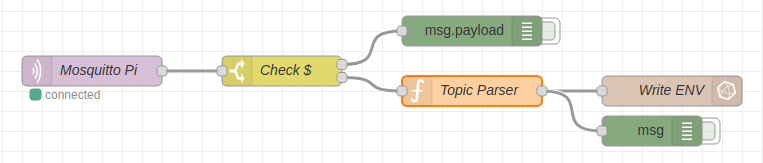
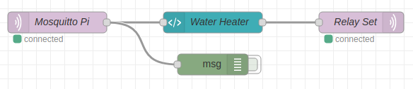
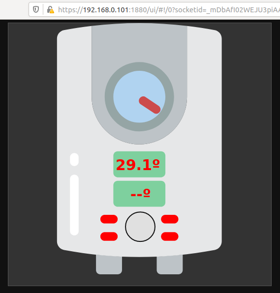

# PLA9 (Node-RED)

Este es el código fuente de Node-RED para la PLA9. Hay más documentación en el repositorio del código para la MKR1000 en http://github.com/gnietoUOC/PLA9.

## Flujo MQTT -> InfluxDB

El primero de ellos es el que se subscribe al broker Mosquitto y guarda la información recibida a través de los mensajes MQTT como registros en InflusDB.
Tanto los nodos de Mosquitto como InfluxDB han sido configurados para usar SSL/TLS y credenciales.

## Flujo Dashboard

El segundo de ellos es el flujo para crear un mini dashboard. En realidad este dashboard únicamente muestra una imágen SVG usando el componente Template. Se han añadido unas líneas de Javascript para poder actuar cuando se pulse sobre la imagen.

El aspecto de ese mini dashboard se muestra a continuación.

